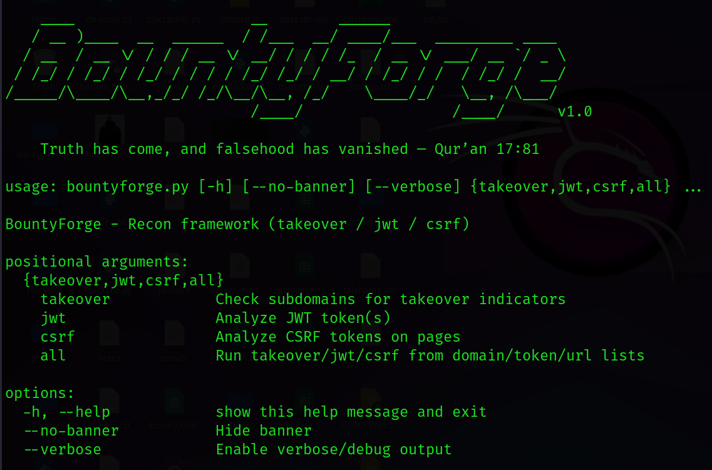
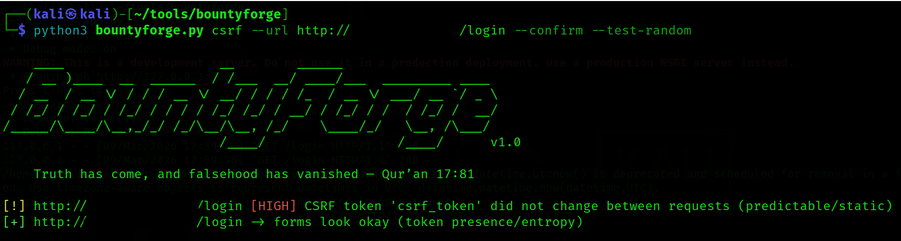
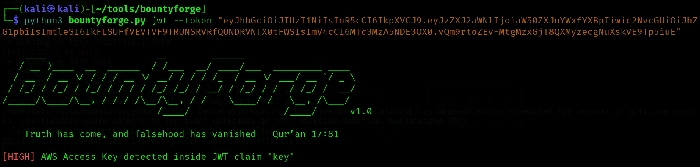

# 🔥 BountyForge

<div align="center">
  
</div>

**A lightweight offensive security recon framework
for modern bug bounty workflows.**

> Automating subdomain takeover detection, JWT security analysis, and CSRF token inspection in a single powerful CLI framework.


## 📚 Table of Contents

- Overview
- Key Features
- Why This Tool Matters
- Technical Highlights
- Installation
- Usage
- screenshots
- Use Cases
- Performance
- Security Research Applications
- Contributing
- Disclaimer

---

# 🧭 Overview

**BountyForge** is a Python-based cybersecurity automation framework designed to help **bug bounty hunters, penetration testers, and security researchers** perform fast reconnaissance and security analysis.

Modern bug bounty workflows require checking multiple security surfaces such as:

- Subdomain takeover vulnerabilities
- JWT token weaknesses
- CSRF implementation flaws

Manually testing these can be **time-consuming and error-prone**.

**BountyForge solves this problem** by providing a lightweight command-line framework that automates these checks and generates structured JSON reports.

It enables researchers to:

- Quickly detect **potential subdomain takeover indicators**
- Inspect **JWT tokens for common misconfigurations**
- Analyze **CSRF protection implementations on web forms**

All within a **single modular security toolkit.**

---

# ⚡ Key Features

• 🔎 **Subdomain Takeover Detection**

Detects cloud service CNAME indicators and potential takeover fingerprints.

---

• 🔐 **JWT Security Analysis**

Analyzes JSON Web Tokens for common weaknesses including:

- `alg=none` vulnerabilities
- Expired tokens
- Weak payload structures
- Potential secrets inside token payloads

---

• 🛡 **CSRF Protection Analyzer**

Automatically inspects web forms to detect:

- Missing CSRF tokens
- Low-entropy tokens
- Static or predictable tokens

---

• 🚀 **Concurrent DNS Scanning**

Multi-threaded architecture for fast subdomain takeover checks.

---

• 🧠 **Entropy-Based Security Analysis**

Uses entropy calculations to detect weak security tokens and potential secrets.

---

• 📊 **Structured JSON Reporting**

Results can be exported as JSON for automation pipelines and reporting.

---

• 💻 **Clean CLI Interface**

Designed for efficient command-line workflows.

---

• 🪶 **Lightweight & Fast**

Minimal dependencies and optimized scanning logic.

---

# 🧩 Why This Tool Matters

Bug bounty researchers often rely on multiple tools for different tasks.

Typical workflow:

1️⃣ Subdomain enumeration  
2️⃣ Subdomain takeover checks  
3️⃣ Token analysis  
4️⃣ Authentication security testing  

These tasks are usually scattered across different scripts.

**BountyForge centralizes them into a single recon framework.**

### Real-World Scenarios

Bug bounty hunters can use BountyForge to:

- Identify **dangling cloud resources** linked to subdomains
- Analyze **JWT tokens leaked in APIs**
- Test **CSRF token implementations on login forms**
- Integrate security checks into **automated recon pipelines**

---

# 🧠 Technical Highlights

This project demonstrates several production-grade engineering practices:

✔ Python-based security automation  
✔ Modular CLI framework architecture  
✔ Concurrent scanning using `ThreadPoolExecutor`  
✔ Structured vulnerability reporting (JSON)  
✔ Entropy-based security analysis algorithms  
✔ HTTP request resilience with retry strategies  
✔ BeautifulSoup-powered HTML parsing  
✔ Secure DNS lookups using `dnspython`  
✔ Clean logging and debugging support  

This tool represents **real-world offensive security engineering** used in modern reconnaissance workflows.

---

# ⚙️ Installation

Clone the repository:

```bash
git clone https://github.com/hackyshadab/bountyforge.git
cd bountyforge
```
## Install Dependencies

```bash
pip install -r requirements.txt
```

Or manually install:

```bash
pip install requests beautifulsoup4 PyJWT dnspython urllib3
```

---

## Python Version

Recommended:

```
Python 3.8+
```

---

# 🚀 Usage

## 1️⃣ Subdomain Takeover Detection

Scan a list of subdomains:

```bash
python3 bountyforge.py takeover -d subdomains.txt
```

Enable HTTP fingerprint probing:

```bash
python3 bountyforge.py takeover -d subdomains.txt --confirm --http-probe
```

Save results:

```bash
python3 bountyforge.py takeover -d subdomains.txt -o report.json
```

---

## 2️⃣ JWT Token Analysis

Analyze a single JWT token:

```bash
python3 bountyforge.py jwt --token "eyJhbGciOiJIUzI1NiIsInR5cCI6IkpXVCJ9..."
```

Analyze multiple tokens from file:

```bash
python3 bountyforge.py jwt -i tokens.txt
```

Save report:

```bash
python3 bountyforge.py jwt --token "<JWT>" -o jwt_report.json
```

---

## 3️⃣ CSRF Token Analysis

Analyze a webpage for CSRF protection:

```bash
python3 bountyforge.py csrf --url https://example.com/login --confirm
```

Test token randomness:

```bash
python3 bountyforge.py csrf --url https://example.com/login --confirm --test-random
```

---

## 4️⃣ Run All Modules

Run all checks together:

```bash
python3 bountyforge.py all -D domains.txt -U urls.txt --confirm
```

---
## 📸 Screenshots

Below are example outputs from **BountyForge** demonstrating vulnerability detection in action.

### CLI Help Section

Example CLI output showing the help menu of BountyForge:



This shows the **available commands and options** in BountyForge, making it easier for users to understand how to run subdomain takeover, JWT analysis, and CSRF checks.

### CSRF Token Analysis

Example CLI output detecting a static CSRF token:




This indicates that the CSRF token does not change between requests, which may lead to **predictable token vulnerabilities**.

---

### JWT Security Analysis

Example CLI output detecting a leaked credential inside a JWT payload:



This highlights a **potential secret exposure vulnerability**, where sensitive credentials are embedded inside a JWT token.

---

# 🎯 Use Cases

BountyForge is useful for:

### 🐞 Bug Bounty Reconnaissance
Automating vulnerability discovery across domains.

### 🔎 Subdomain Takeover Detection
Identify dangling cloud resources before attackers do.

### 🔐 Authentication Security Analysis
Inspect JWT tokens used in APIs and web applications.

### 🧪 Web Application Security Testing
Evaluate CSRF protection mechanisms in login forms and sensitive actions.

### 🤖 Security Automation Pipelines
Integrate into automated recon workflows.

---

# ⚡ Performance & Efficiency

BountyForge is designed to be:

- ✔ Lightweight
- ✔ Fast
- ✔ Automation-friendly
- ✔ Concurrent for DNS scanning

Threaded architecture enables fast scanning of large subdomain lists.

---

# 🧪 Security Research Applications

Security researchers can integrate BountyForge into:

- Recon automation pipelines
- Bug bounty workflows
- API testing environments
- Continuous security monitoring scripts

Example integration:

```
subfinder → httpx → BountyForge
```
---

# 🤝 Contributing

Contributions are welcome!

If you'd like to improve **BountyForge**:

1. Fork the repository
2. Create a feature branch
3. Submit a pull request

Bug reports and feature suggestions are highly appreciated.

---

# ⚠ Disclaimer

This tool is intended for:

**Educational purposes and authorized security testing only.**

Do not scan systems or websites without **explicit permission**.

The author is **not responsible for misuse** of this tool.

---

# 👨‍💻 Author

**GitHub:** `hackyshadab`

---

# ⭐ Support the Project

If you find **BountyForge** useful for bug bounty hunting:

- ⭐ Star the repository
- 🍴 Fork it
- 🐞 Report issues

Your support helps improve the project!
